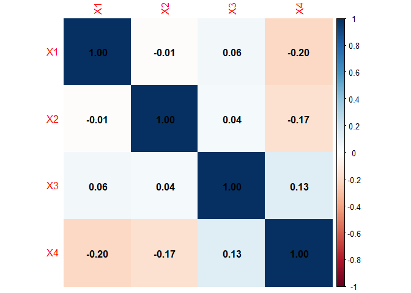
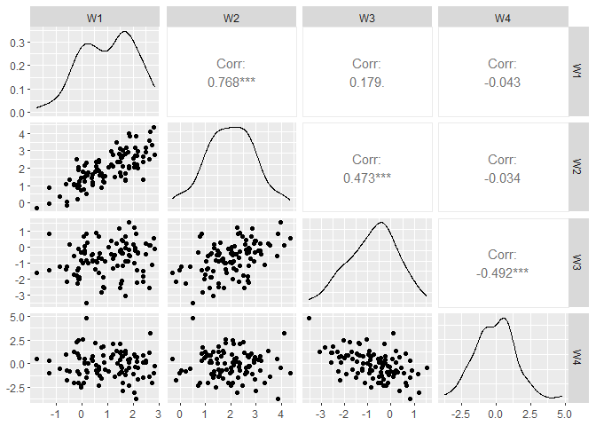
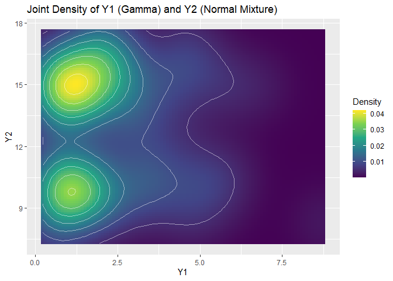
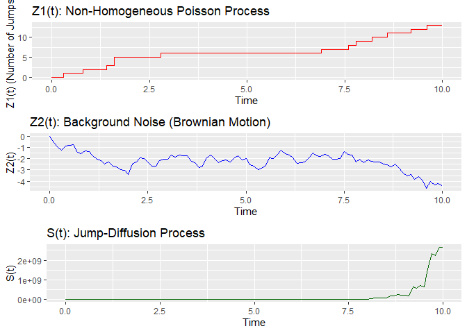

FA1_STAT_COMPUTING_AFUNDAR
================
Audrie Lex L. Afundar
2025-06-19

## X1 Geometric Distribution

``` r
n<-100

X1<-rgeom(n, prob=0.2)+1
```

## X2 Geometric Distribution

``` r
X2<-rgeom(n, prob=0.2)+2
```

## X3 Poisson Distribution

``` r
X3<-rpois(n, lambda=4)
```

## X4 Binomial Distribution

``` r
X4<-rbinom(n, size=12, prob=0.2)
```

## Y1 Gamma distribution

``` r
Y1<-rgamma(n, shape=2, rate=1)
```

## Y2 Binomial Distribution with Normal Distribution

``` r
method<-rbinom(n, size=2, prob=0.3)
Y2<- ifelse(method==1, rnorm(n, mean=10, sd=1), rnorm(n, mean=15, sd=1))
```

## Z Nonhomogeneous poisson process with Brownian motion

``` r
lambda_max <- 2
dt <- 0.1
time <- seq(0, n * dt, by = dt)

M <- rpois(1, lambda_max * n)
Tn <- rexp(M, lambda_max)
Sn <- cumsum(Tn)
Sn <- Sn[Sn <= n * dt]

Un <- runif(length(Sn))
keep <- (Un <= (1 + sin(Sn)) / lambda_max)
Z1_jump <- Sn[keep]
Z1 <- sapply(time, function(t) sum(Z1_jump <= t))

Z2 <- cumsum(rnorm(length(time), mean = 0, sd = sqrt(dt)))
Z2[1] <- 0

Z <- data.frame(
  Time = time,
  Z1 = Z1,
  Z2 = Z2
)
```

## W Multivariate normal distribution

``` r
mu <- c(1, 2, -1, 0)
sigma <- matrix(c(1, 0.8, 0.2, 0,0.8, 1, 0.4, 0.1,0.2, 0.4, 1, -0.5,0, 0.1, -0.5, 2), nrow = 4, ncol = 4)

rmvn.eigen <- function(n, mu, sigma) {
  d <- length(mu)
  ev <- eigen(sigma, symmetric = TRUE)
  lambda <- ev$values
  V <- ev$vectors
  R <- V %*% diag(sqrt(lambda)) %*% t(V)
  G <- matrix(rnorm(n * d), nrow = n, ncol = d)
  W <- G %*% R + matrix(mu, n, d, byrow = TRUE)
  return(W)
}

W <- rmvn.eigen(n, mu, sigma)
```

## Visualizations

2a. Relationship of X1, X2, X3, X4

``` r
library(corrplot)
```

    ## corrplot 0.95 loaded

``` r
X<-data.frame(X1,X2,X3,X4)

corrplot(cor(X), method = "color", addCoef.col = "black")
```

<!-- -->

Based on the correlation plot of the relationship of X1,X2,X3,X4, there
are no strong relationship between all relationships. There are only a
few with 0.1 weak relationship such as X2 and X4 while also having
negative relationship of -0.15 on X1 and X2 but not indicating anything
strong.

2b. W

``` r
library(GGally)
```

    ## Loading required package: ggplot2

    ## Registered S3 method overwritten by 'GGally':
    ##   method from   
    ##   +.gg   ggplot2

``` r
colnames(W) <- c("W1", "W2", "W3", "W4")
ggpairs(as.data.frame(W))
```

<!-- -->

2c. Joint density of Y1(w) and Y2(s) visualization

``` r
library(MASS)

density_est <- kde2d(Y1, Y2, n = 100)

df_density <- expand.grid(x = density_est$x, y = density_est$y)
df_density$z <- as.vector(density_est$z)

ggplot(df_density, aes(x = x, y = y, fill = z)) +
  geom_tile() +
  geom_contour(aes(z = z), color = "white", alpha = 0.5) +
  scale_fill_viridis_c() +
  labs(
    title = "Joint Density of Y1 (Gamma) and Y2 (Normal Mixture)",
    x = "Y1",
    y = "Y2",
    fill = "Density"
  )
```

    ## Warning: The following aesthetics were dropped during statistical transformation: fill.
    ## ℹ This can happen when ggplot fails to infer the correct grouping structure in
    ##   the data.
    ## ℹ Did you forget to specify a `group` aesthetic or to convert a numerical
    ##   variable into a factor?

<!-- -->

2d. Jump-diffusion process

``` r
library(ggplot2)
library(gridExtra)

J <- rlnorm(length(Z$Time), meanlog = 0, sdlog = 0.2)
JumpSum <- cumsum(diff(c(0, Z$Z1)) * J)
S_t <- exp(Z$Time + 0.5 * Z$Z2 + JumpSum)

Z$S <- S_t

p1 <- ggplot(Z, aes(x = Time, y = Z1)) +
  geom_step(color = "red") +
  labs(title = "Z1(t): Non-Homogeneous Poisson Process",
       x = "Time", y = "Z1(t) (Number of Jumps)")

p2 <- ggplot(Z, aes(x = Time, y = Z2)) +
  geom_line(color = "blue") +
  labs(title = "Z2(t): Background Noise (Brownian Motion)",
       x = "Time", y = "Z2(t)")

p3 <- ggplot(Z, aes(x = Time, y = S)) +
  geom_line(color = "darkgreen") +
  labs(title = "S(t): Jump-Diffusion Process",
       x = "Time", y = "S(t)")

grid.arrange(p1, p2, p3, ncol = 1)
```

<!-- -->
