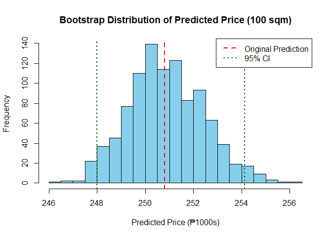

FA3_STATCOMP_AFUNDAR
================
Audrie Lex L. Afundar
2025-07-06

## R Markdown

This is an R Markdown document. Markdown is a simple formatting syntax
for authoring HTML, PDF, and MS Word documents. For more details on
using R Markdown see <http://rmarkdown.rstudio.com>.

When you click the **Knit** button a document will be generated that
includes both content as well as the output of any embedded R code
chunks within the document. You can embed an R code chunk like this:

``` r
house_df<-read_xlsx("D:/Download folder/riverside_house_prices.xlsx")

house_df
```

    ## # A tibble: 25 × 3
    ##    House Area_sqm Price_1000s
    ##    <dbl>    <dbl>       <dbl>
    ##  1     1      121        289.
    ##  2     2       84        216.
    ##  3     3      141        317.
    ##  4     4      130        325.
    ##  5     5       90        230.
    ##  6     6      144        342.
    ##  7     7      144        342.
    ##  8     8       93        244.
    ##  9     9       72        191.
    ## 10    10       91        232.
    ## # ℹ 15 more rows

## Including Plots

Fit a simple linear regression model:

``` r
price_lm<-lm(Price_1000s~Area_sqm, data=house_df)

summary(price_lm)
```

    ## 
    ## Call:
    ## lm(formula = Price_1000s ~ Area_sqm, data = house_df)
    ## 
    ## Residuals:
    ##     Min      1Q  Median      3Q     Max 
    ## -15.922  -4.511  -1.037   2.983  15.081 
    ## 
    ## Coefficients:
    ##             Estimate Std. Error t value Pr(>|t|)    
    ## (Intercept) 49.96513    7.68630   6.501 1.24e-06 ***
    ## Area_sqm     2.00849    0.06823  29.438  < 2e-16 ***
    ## ---
    ## Signif. codes:  0 '***' 0.001 '**' 0.01 '*' 0.05 '.' 0.1 ' ' 1
    ## 
    ## Residual standard error: 8.043 on 23 degrees of freedom
    ## Multiple R-squared:  0.9741, Adjusted R-squared:  0.973 
    ## F-statistic: 866.6 on 1 and 23 DF,  p-value: < 2.2e-16

With 97.41% explanatory power, the intercept seen in the summary is
49.96513 with a slope of 2.00849.

For intercept, if area_sqm=0 then the price is 49.96513 (in thousands =
49,965.13). For the slope, as area_sqm increases per additional 1 square
meter, the price increases by 2.00849 (in thousands = 2,008.49).

Thus the formula for the linear regression model is:

    Price_1000s=49.96513+2.00849*Area_sqm

However, due to the low sample size, the 97.41% explained variance can
be misleading thus increasing the R^2. Moreover, estimates on intercepts
and slopes are less precise and reliable.

Therefore, using resampling techniques such as bootstrap and jackknife
in the linear regression model to assess its reliability.

``` r
plot(house_df$Area_sqm, house_df$Price_1000s,
     main = "Linear Regression Model for Price",
     xlab = "Area (sqm)",
     ylab = "Price (1000s)",
     pch = 19, col = "steelblue")

abline(price_lm, col = "red", lwd = 2)
legend("topleft", legend = "Fitted Line", col = "red", lwd = 2)
```

<!-- -->

``` r
library(boot)
```

    ## 
    ## Attaching package: 'boot'

    ## The following object is masked from 'package:car':
    ## 
    ##     logit

``` r
rsq <- function(formula, data, indices)
{
  d <- data[indices,] 
  fit <- lm(formula, data=d)
  return(coef(fit)[2])
}
results <- boot(data=house_df, statistic=rsq,
   R=1000, formula=Price_1000s~Area_sqm)

results
```

    ## 
    ## ORDINARY NONPARAMETRIC BOOTSTRAP
    ## 
    ## 
    ## Call:
    ## boot(data = house_df, statistic = rsq, R = 1000, formula = Price_1000s ~ 
    ##     Area_sqm)
    ## 
    ## 
    ## Bootstrap Statistics :
    ##     original      bias    std. error
    ## t1* 2.008487 0.002217885  0.06758777

``` r
slope_orig <- results$t0
slope_boots <- results$t
se_boot <- sd(slope_boots)
bias_boot <- mean(slope_boots) - slope_orig
plot(results)
```

<!-- -->
Based on the result, the bias is -0.001823445 indicating a very small
bias, so the result is neither over or under estimating the slope.
Moreover, the std. error is 0.07032208 which varies by the amount (in
thousands = 70.32) which is very small indicating a reliable and and
precise estimate.

In the figure, it shows the histogram of the slope estimates, as well as
the Q-Q plot of it. For the histogram, it is centered around
approximately 2.0, which was approximately equal to the result of the
linear regresison model. Moreover, the figure is roughly symmetrical
suggesting a stable slope estimate. For the Q-Q plot, the points mostly
lie in the diagonal line, indicating that the distribution is normal.
There was a slight deviation on the left tail and right tail but no
skewness indicator.

``` r
hist(results$t,
     breaks = 30,
     col = "skyblue",
     main = "Bootstrap Distribution",
     xlab = "Predicted Price (₱1000s)")

abline(v = results$t0, col = "red", lwd = 2, lty = 2)      
abline(v = quantile(results$t, c(0.025, 0.975)), col = "darkgreen", lwd = 2, lty = 3)  
legend("topright",
       legend = c("Original Prediction", "95% CI"),
       col = c("red", "darkgreen"),
       lty = c(2, 3),
       lwd = 2)
```

<!-- -->

``` r
boot.ci(results, type = "perc")
```

    ## BOOTSTRAP CONFIDENCE INTERVAL CALCULATIONS
    ## Based on 1000 bootstrap replicates
    ## 
    ## CALL : 
    ## boot.ci(boot.out = results, type = "perc")
    ## 
    ## Intervals : 
    ## Level     Percentile     
    ## 95%   ( 1.860,  2.135 )  
    ## Calculations and Intervals on Original Scale

With the result, we are 95% confident that the true slope which
increases the house price per square meter is in the interval 1.856 and
2.136. Thus, in the real life scenario, the house price increase per
square meter is between 1856 and 2136.

Another sampling method that can be used is the jackknife resampling
method.

``` r
n <- nrow(house_df)
theta_hat<-coef(price_lm)[2]
theta_jack <- numeric(n)

for (i in 1:n) {
  d_jack <- house_df[-i, ]  # leave one observation out
  fit_jack <- lm(Price_1000s ~ Area_sqm, data = d_jack)
  theta_jack[i] <- coef(fit_jack)[2]  # slope estimate
}

bias_jack<-(n-1)*(mean(theta_jack)-theta_hat)
se_jack <- sqrt((n-1)*mean((theta_jack - mean(theta_jack))^2))
cat("Jackknife Bias:", bias_jack, "\n")
```

    ## Jackknife Bias: -0.001081638

``` r
cat("Jackknife Standard error:", se_jack, "\n")
```

    ## Jackknife Standard error: 0.07098224

``` r
comparison <- data.frame(
  Method = c("Bootstrap", "Jackknife"),
  Standard_Error = c(se_boot, se_jack),
  Bias = c(bias_boot, bias_jack)
)

comparison
```

    ##      Method Standard_Error         Bias
    ## 1 Bootstrap     0.06758777  0.002217885
    ## 2 Jackknife     0.07098224 -0.001081638

``` r
theta_hat <- predict(price_lm, newdata = data.frame(Area_sqm = 100))

cat("Original Predicted House Price:", theta_hat, "\n")
```

    ## Original Predicted House Price: 250.8138

``` r
predict_100 <- function(data, indices) {
  d <- data[indices, ]
  fit <- lm(Price_1000s ~ Area_sqm, data = d)
  pred <- predict(fit, newdata = data.frame(Area_sqm = 100))
  return(pred)
}

boot_results <- boot(data = house_df, statistic = predict_100, R = 1000)

pred_boots <- boot_results$t
pred_mean <- mean(pred_boots)
bias_boot <- pred_mean - theta_hat
se_boot <- sd(pred_boots)

cat("Bootstrap Mean Prediction:", pred_mean, "\n")
```

    ## Bootstrap Mean Prediction: 250.8701

``` r
cat("Bootstrap Bias:", bias_boot, "\n")
```

    ## Bootstrap Bias: 0.05637018

``` r
cat("Bootstrap SE:", se_boot, "\n")
```

    ## Bootstrap SE: 1.56043

``` r
n <- nrow(house_df)
jab <- numeric(n)

for (i in 1:n) {
  d_jack <- house_df[-i, ]
  boot_jack <- boot(data = d_jack, statistic = predict_100, R = 1000)
  jab[i] <- mean(boot_jack$t)  # mean bootstrap prediction without i-th obs
}

bias_jab <- (n - 1) * (mean(jab) - theta_hat)
jab_mean <- mean(jab)
se_jab <- sqrt((n - 1) / n * sum((jab - jab_mean)^2))

cat("Jackknife-after-Bootstrap Bias:", bias_jab, "\n")
```

    ## Jackknife-after-Bootstrap Bias: 0.8047073

``` r
cat("Jackknife-after-Bootstrap SE:", se_jab, "\n")
```

    ## Jackknife-after-Bootstrap SE: 1.55438

``` r
cat("Jackknife-after-Bootstrap Mean Pred:", jab_mean, "\n")
```

    ## Jackknife-after-Bootstrap Mean Pred: 250.8473

``` r
cat("===== PRICE PREDICTION FOR 100 SQM HOUSE =====\n")
```

    ## ===== PRICE PREDICTION FOR 100 SQM HOUSE =====

``` r
cat("Original Predicted Price:", theta_hat, "\n\n")
```

    ## Original Predicted Price: 250.8138

``` r
cat("----- Bootstrap Results -----\n")
```

    ## ----- Bootstrap Results -----

``` r
cat("Bootstrap Mean Prediction    :", pred_mean, "\n")
```

    ## Bootstrap Mean Prediction    : 250.8701

``` r
cat("Bootstrap Bias               :", bias_boot, "\n")
```

    ## Bootstrap Bias               : 0.05637018

``` r
cat("Bootstrap SE                 :", se_boot, "\n\n")
```

    ## Bootstrap SE                 : 1.56043

``` r
cat("----- Jackknife-after-Bootstrap Results -----\n")
```

    ## ----- Jackknife-after-Bootstrap Results -----

``` r
cat("Jackknife Mean Prediction    :", jab_mean, "\n")
```

    ## Jackknife Mean Prediction    : 250.8473

``` r
cat("Jackknife Bias               :", bias_jab, "\n")
```

    ## Jackknife Bias               : 0.8047073

``` r
cat("Jackknife SE                 :", se_jab, "\n")
```

    ## Jackknife SE                 : 1.55438

``` r
hist(boot_results$t,
     breaks = 30,
     col = "skyblue",
     main = "Bootstrap Distribution of Predicted Price (100 sqm)",
     xlab = "Predicted Price (₱1000s)")

abline(v = boot_results$t0, col = "red", lwd = 2, lty = 2)      
abline(v = quantile(boot_results$t, c(0.025, 0.975)), col = "darkgreen", lwd = 2, lty = 3)  
legend("topright",
       legend = c("Original Prediction", "95% CI"),
       col = c("red", "darkgreen"),
       lty = c(2, 3),
       lwd = 2)
```

<!-- -->

``` r
boot.ci(boot_results, type = "perc")
```

    ## BOOTSTRAP CONFIDENCE INTERVAL CALCULATIONS
    ## Based on 1000 bootstrap replicates
    ## 
    ## CALL : 
    ## boot.ci(boot.out = boot_results, type = "perc")
    ## 
    ## Intervals : 
    ## Level     Percentile     
    ## 95%   (248.0, 254.1 )  
    ## Calculations and Intervals on Original Scale
