FA4_STATCOMP_AFUNDAR
================
Audrie Lex L. Afundar
2025-07-11

## R Markdown

This is an R Markdown document. Markdown is a simple formatting syntax
for authoring HTML, PDF, and MS Word documents. For more details on
using R Markdown see <http://rmarkdown.rstudio.com>.

When you click the **Knit** button a document will be generated that
includes both content as well as the output of any embedded R code
chunks within the document. You can embed an R code chunk like this:

``` r
temp_df<-read.csv("D:/Download folder/task1_temperature_data.csv")

head(temp_df)
```

    ##   Day Coastal_Temp Inland_Temp
    ## 1   1         28.0        31.3
    ## 2   2         27.4        34.2
    ## 3   3         28.1        32.0
    ## 4   4         29.0        30.7
    ## 5   5         27.3        33.0
    ## 6   6         27.3        30.5

``` r
coast<-as.numeric(temp_df$Coastal_Temp)
inland<-as.numeric(temp_df$Inland_Temp)

head(coast)
```

    ## [1] 28.0 27.4 28.1 29.0 27.3 27.3

``` r
head(inland)
```

    ## [1] 31.3 34.2 32.0 30.7 33.0 30.5

Sample A: Coastal Temperature across the 30 days Sample B: Inland
Temperature across the 30 days

Null Hypothesis: There is no difference in the temperature distribution
between coastal and inland stations.

Alternative Hypothesis: There is a difference in the temperature
distribution between coastal and inland stations.

``` r
R<-10000

z<-c(coast,inland)
K<-1:26
D<-numeric(R)

options(warn=-1)

D0<-suppressMessages(suppressWarnings(ks.test(coast, inland, exact=FALSE)$statistic))
for(i in 1:R){
  k<-sample(K,size=14, replace=FALSE)
  coast_1<-z[k]
  inland_1<-z[-k]
  
  D[i]<-suppressMessages(suppressWarnings(ks.test(coast_1,inland_1, exact=FALSE)$statistic))
}

p<-mean(c(D0, D)>=D0)
options(warn=0)
cat("P-value with KS test using Permutation approach:", p, "\n")
```

    ## P-value with KS test using Permutation approach: 9.999e-05

As seen in the KS test with Permutation approach, the p-value is
0.000999001 which is less than 0.05. Thus, we reject the null hypothesis
indicating that there is a statistically significant difference between
the coastal and inland daily temperature.

``` r
hist(D, main = "Permutation Test Null Distribution (KS Statistic)",
     freq = FALSE, xlab = "KS Statistic (D)", breaks = "scott",
     col = "lightgray", border = "white",
     xlim = range(c(D, D0)))

points(D0, 0, cex = 1, pch = 16)
```

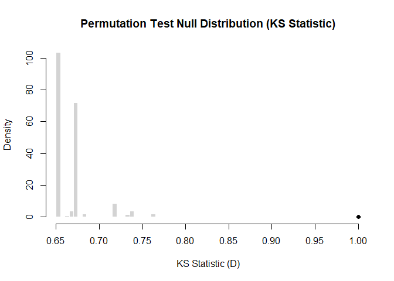<!-- -->

Figure 1 shows the histogram distribution of the D KS test with D0
point. As seen in the figure, the D0 point is extremely far from the
distribution indicating that there is a massive difference between the
temperature of both coastal and inland. Moreover, all inland temperature
is greater than all coastal temperature, therefore, their ECDFs do not
overlap thus justifiying the distance in the figure.

Task 2 You are modeling the success rate p of a rare bird species
successfully nesting in an urban reserve. Out of 20 observed nests, 6
were successful

Assume: • The number of successes follows a Binomial distribution:
X∼Binomial(n = 20, p) • You use a Beta prior for p: p∼Beta(2,2)

Considering the assumption, the posterior distribution of p is: p\|x = x
~ Beta(α+x, β+(n-x))

Substituting this, p\|x = 6 ~ Beta(2+6, 2+(20-6)) p\|x = 6 ~ Beta(8, 16)

``` r
group <- factor(c(rep("Coast", length(coast)), rep("Inland", length(inland))))

sm.density.compare(c(coast, inland),group, xlab="Value")

legend("topright", levels(group), col = 2:(1 + length(levels(group))), lty = 1)
```

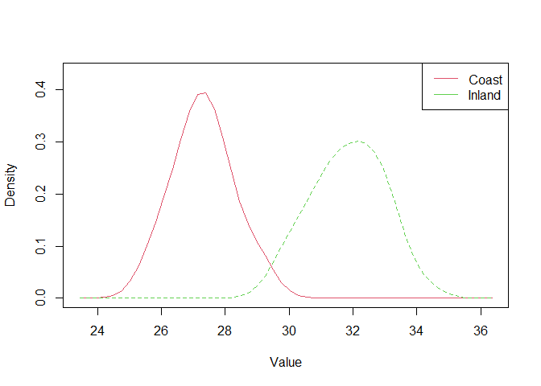<!-- -->

``` r
target <- function(p){
  if (p < 0 || p > 1) {
    return(0)}
  dbeta(p, 8, 16)
}

metropolis_MCMC <- function(niter, startval, proposalsd) {
  x <- rep(0, niter)
  x[1] <- startval
  for (i in 2:niter) {
    currentx <- x[i - 1]
    proposedx <- rnorm(1, mean = currentx, sd = proposalsd)
    A <- target(proposedx) / target(currentx)
    if (runif(1) < A) {
      x[i] <- proposedx
    } else {
      x[i] <- currentx
    }
  }
  return(x)
}

sample<-metropolis_MCMC(niter=5000, startval = 0.5, proposalsd = 0.05)


plot(sample, type = "l", main = "Trace plot of p", ylab = "p", xlab = "Iteration")
```

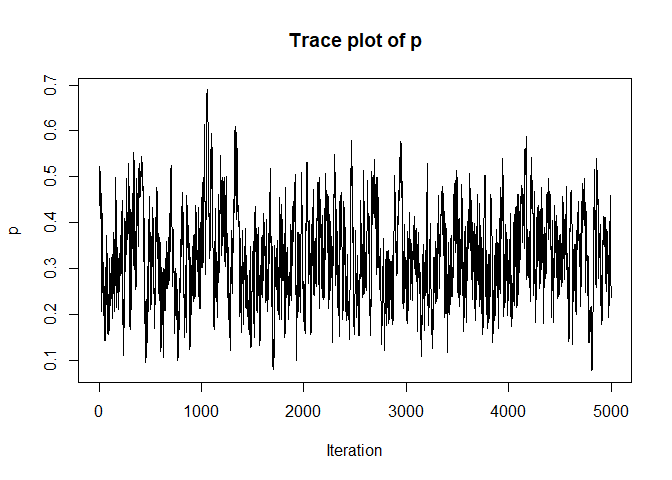<!-- -->

``` r
hist(sample, breaks = 40, col = "skyblue", freq = FALSE, main = "Posterior of p")
curve(dbeta(x, 8, 16), add = TRUE, col = "red", lwd = 2)
```

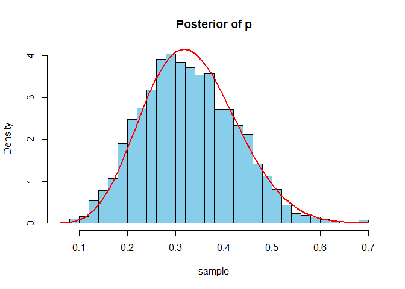<!-- -->

``` r
target <- function(p){
  if (p < 0 || p > 1) {
    return(0)
  }
  dbeta(p, 8, 16)
}

metropolis_MCMC <- function(niter, startval, proposalsd) {
  x <- rep(0, niter)
  x[1] <- startval
  accept <- 0
  
  for (i in 2:niter) {
    currentx <- x[i - 1]
    proposedx <- rnorm(1, mean = currentx, sd = proposalsd)
    
    A <- target(proposedx) / target(currentx)
    if (runif(1) < A) {
      x[i] <- proposedx
      accept <- accept + 1
    } else {
      x[i] <- currentx
    }
  }
  
  list(samples = x, acceptance_rate = accept / (niter - 1))
}

proposal_sds <- c(0.01, 0.05, 0.2)

par(mfrow = c(length(proposal_sds), 2))  

for (sd in proposal_sds) {
  result <- metropolis_MCMC(niter = 5000, startval = 0.5, proposalsd = sd)
  samples <- result$samples
  acc_rate <- result$acceptance_rate

  plot(samples, type = "l",
       main = paste("Trace plot (SD =", sd, ")"),
       xlab = "Iteration", ylab = "p")
  
  hist(samples, breaks = 40, col = "skyblue", freq = FALSE,
       main = paste("Posterior of p\n(SD =", sd, ", Accept =", round(acc_rate, 3), ")"),
       xlab = "p")
  curve(dbeta(x, 8, 16), add = TRUE, col = "red", lwd = 2)
}
```

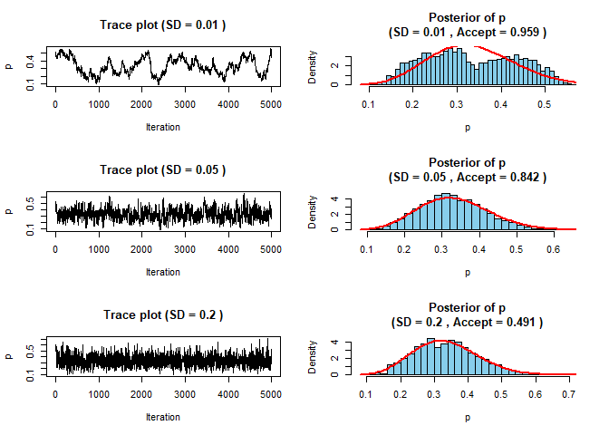<!-- -->

``` r
ci_bird<-quantile(sample, probs=c(0.025,0.975))
mean_bird<-mean(sample)

cat("95% credible interval of p using Metropolis sampler:", ci_bird, "\n")
```

    ## 95% credible interval of p using Metropolis sampler: 0.1541273 0.5187881

``` r
cat("Posterior mean of p using Metropolis sampler:", mean_bird, "\n")
```

    ## Posterior mean of p using Metropolis sampler: 0.3269141

## change

Metropolis Simple to implement.

Uses local random walk proposals (e.g., Normal jumps around the current
value).

Works well in low dimensions.

Perfect for a 1D continuous posterior like 𝑝 ∼ Beta ( 8 , 16 )
p∼Beta(8,16).

No need to compute proposal densities (unlike Metropolis-Hastings).

Chosen here because it’s straightforward and effective for this 1D
problem.

Task 3

``` r
coast_df<-read.csv("D:/Download folder/task3_coastal_bivariate_data.csv")

head(coast_df)
```

    ##   Day Coastal_Temp Coastal_Humidity
    ## 1   1         28.0             72.6
    ## 2   2         27.4             74.1
    ## 3   3         28.1             69.5
    ## 4   4         29.0             69.0
    ## 5   5         27.3             79.1
    ## 6   6         27.3             81.8

``` r
temp<-as.numeric(coast_df$Coastal_Temp)
humidity<-as.numeric(coast_df$Coastal_Humidity)

temp
```

    ##  [1] 28.0 27.4 28.1 29.0 27.3 27.3 29.1 28.3 27.0 28.0 27.0 27.0 27.7 25.6 25.8
    ## [16] 26.9 26.5 27.8 26.6 26.1 29.0 27.3 27.6 26.1 27.0 27.6 26.3 27.9 26.9 27.2

``` r
humidity
```

    ##  [1] 72.6 74.1 69.5 69.0 79.1 81.8 74.6 80.0 76.8 71.8 76.8 82.7 74.8 82.8 61.9
    ## [16] 79.1 75.4 73.5 75.5 65.1 73.9 76.8 82.4 72.4 71.0 72.5 79.6 76.6 72.4 77.6

``` r
library(ash)

n<-2000
d<-2
nbin<-c(20,20)
m<-c(5,5)

x <- cbind(temp, humidity)

b<-bin2(x,nbin=nbin)
est<-ash2(b,m=m, kopt=c(1,0))


image(est$x, est$y, est$z,
      col = heat.colors(100),
      xlab = "Temperature",
      ylab = "Humidity",
      main = "2D Density Estimate of Temp vs Humidity")
```

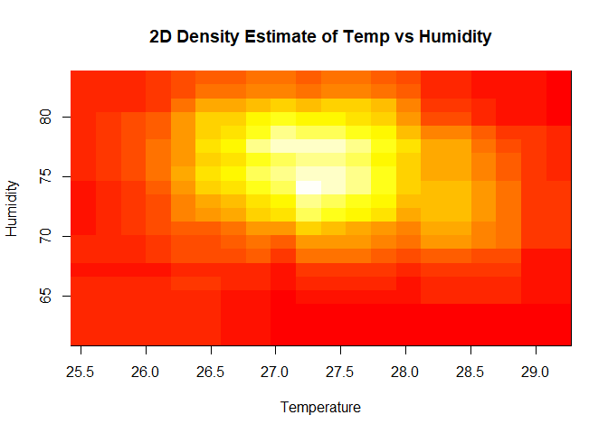<!-- -->

``` r
persp(x=est$x, y=est$y,z=est$z, shade=TRUE,
      xlab = "Temperature",
      ylab="Humidity",
      zlab="",
      theta=30,
      phi=55,
      ltheta=30)
```

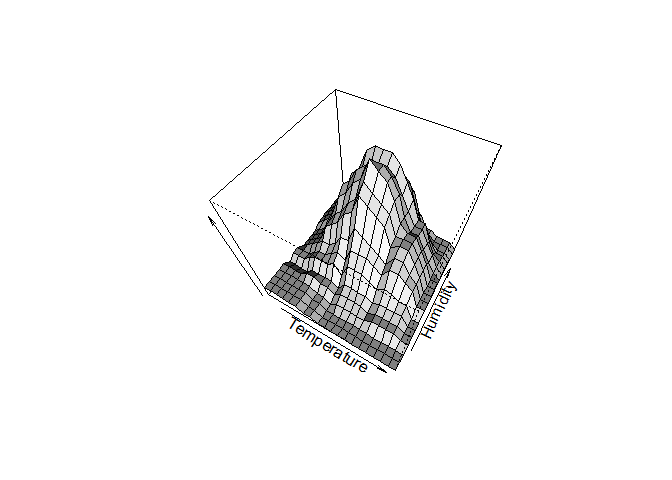<!-- -->

``` r
contour(x=est$x, y=est$y,z=est$z, main="")
```

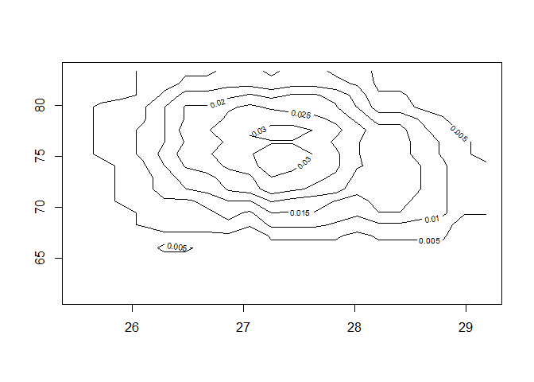<!-- -->

``` r
nbin <- rep(ceiling(1 + log2(n)), 2)  

library(ash)
x <- cbind(temp, humidity)
b <- bin2(x, nbin = nbin)
est <- ash2(b, m = c(5, 5), kopt = c(1, 0))

contour(est$x, est$y, est$z,
        xlab = "Temperature", ylab = "Humidity",
        main = "2D Contour using Sturges-based bin count")
```

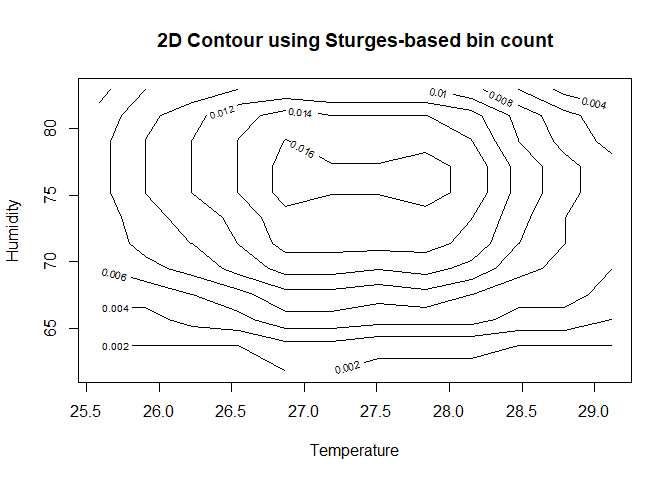<!-- -->

``` r
n <- length(temp)
nclass <- ceiling(1 + log2(n))  # Sturges rule

hist(temp, breaks = nclass, freq = FALSE,
     xlab = "Temperature", main = "Histogram: Temperature (Sturges)")
curve(dnorm(x, mean(temp), sd(temp)), col = "red", add = TRUE)
```

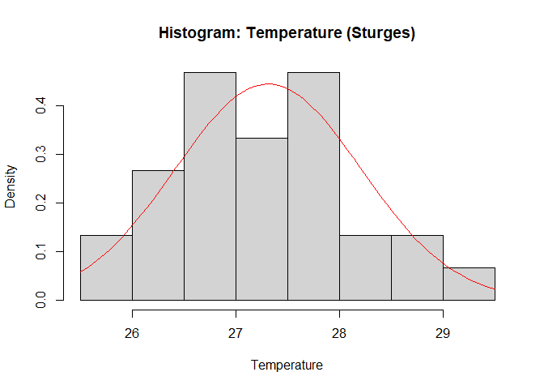<!-- -->

``` r
hist(humidity, breaks = nclass, freq = FALSE,
     xlab = "Humidity", main = "Histogram: Humidity (Sturges)")
curve(dnorm(x, mean(humidity), sd(humidity)), col = "blue", add = TRUE)
```

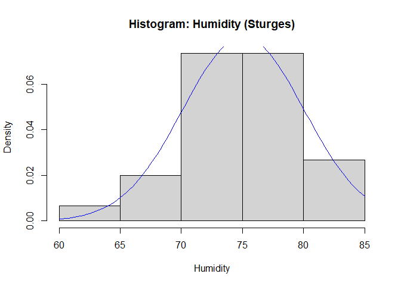<!-- -->
