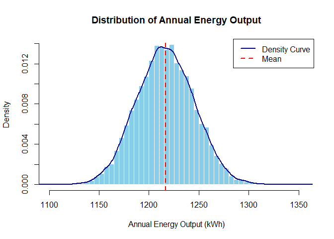

SA1_STATCOMP_AFUNDAR
================
Audrie Lex L. Afundar
2025-06-26

## Number 1

Since we are dealing with a mixture distribution, we would use sample
function to the corresponding energy demand on each day. This will then
include those days depending on their probability inside the
energy_demand array. Lastly, by using rnorm function to generate random
numbers from a normal distribution depending on their mean and sd.

``` r
n_year<-365
day_demand <- sample(c("regular","hot","festive"), size=n_year,replace = TRUE, prob=c(0.6, 0.3, 0.1))

energy_demand <- numeric(n_year)

for(i in 1:n_year){
  if(day_demand[i]=="regular"){
    energy_demand[i]=rnorm(1,mean=70, sd=4)
  }else if (day_demand[i]=="hot"){
    energy_demand[i]=rnorm(1,mean=80, sd=5)
  }else{
    energy_demand[i]=rnorm(1,mean=90, sd=6)
  }
}

print(mean(energy_demand))
```

    ## [1] 74.3503

``` r
print(sd(energy_demand))
```

    ## [1] 8.221716

``` r
hist(energy_demand,
     breaks = 50,
     col = "skyblue",
     border = "white",
     probability = TRUE,
     main = "Distribution of Daily Energy Demand",
     xlab = "Daily Energy Demand")

lines(density(energy_demand), col = "darkblue", lwd = 2)

abline(v = mean(energy_demand), col = "red", lwd = 2, lty = 2)

legend("topright",
       legend = c("Density Curve", "Mean"),
       col = c("darkblue", "red"),
       lwd = 2,
       lty = c(1, 2))
```

<!-- -->

You can also embed plots, for example:

``` r
energy_prod<-numeric(n_year)

for(i in 1:n_year){
  N_t<-rpois(1, lambda=10)
  E_i<-rexp(N_t, rate=3)
  energy_prod[i]<-sum(E_i)
  
}

print(mean(energy_prod))
```

    ## [1] 3.192491

``` r
print(sd(energy_prod))
```

    ## [1] 1.481861

``` r
hist(energy_prod,
     breaks = 50,
     col = "skyblue",
     border = "white",
     probability = TRUE,
     main = "Distribution of Daily Energy Output",
     xlab = "Daily Energy Output (kWh)")

lines(density(energy_prod), col = "darkblue", lwd = 2)

abline(v = mean(energy_prod), col = "red", lwd = 2, lty = 2)

legend("topright",
       legend = c("Density Curve", "Mean"),
       col = c("darkblue", "red"),
       lwd = 2,
       lty = c(1, 2))
```

<!-- -->

## Number 3

Transforming the energy production formula into a function to easily
simulate the annual expected energy output using monte carlo
simulations.

``` r
set.seed(123)

g <- function() {
  energy_prod<- 0
  for (i in 1:365) {
    N_t <- rpois(1, lambda = 10)
    E_i <- rexp(N_t, rate = 3)
    energy_prod <- energy_prod + sum(E_i)
  }
  return(energy_prod)
}

m <- 10000
yearly_output <- numeric(m)

for (i in 1:m) {
  yearly_output[i] <- g()
}

theta.hat <- mean(yearly_output)
theta.var <- var(yearly_output)
sde <- sd(yearly_output) / sqrt(m)

cat("Estimated mean energy output:", round(theta.hat, 2), "\n")
```

    ## Estimated mean energy output: 1216.45

``` r
cat("Estimated variance:", round(theta.var, 2), "\n")
```

    ## Estimated variance: 824.42

``` r
cat("Estimated sde:", round(sde, 4), "\n")
```

    ## Estimated sde: 0.2871

``` r
hist(yearly_output,
     breaks = 50,
     col = "skyblue",
     border = "white",
     probability = TRUE,
     main = "Distribution of Annual Energy Output",
     xlab = "Annual Energy Output (kWh)")

lines(density(yearly_output), col = "darkblue", lwd = 2)

abline(v = mean(yearly_output), col = "red", lwd = 2, lty = 2)

legend("topright",
       legend = c("Density Curve", "Mean"),
       col = c("darkblue", "red"),
       lwd = 2,
       lty = c(1, 2))
```

<!-- -->

``` r
set.seed(123)

g_ant <- function() {
  energy_total <- numeric(2)  

  for (j in 1:2) {
    energy_prod <- 0
    for (i in 1:365) {
      U <- runif(1)
      if (j == 2) U <- 1 - U  

      N_t <- qpois(U, lambda = 10)

      if (N_t > 0) {
        E_i <- rexp(N_t, rate = 3)
        energy_prod <- energy_prod + sum(E_i)
      }
    }
    energy_total[j] <- energy_prod
  }

  return(mean(energy_total))  
}

m <- 100000
yearly_output_ant <- numeric(m)

for (i in 1:m) {
  yearly_output_ant[i] <- g_ant()
}

theta.hat <- mean(yearly_output_ant)
theta.var <- var(yearly_output_ant)
sde <- sd(yearly_output_ant) / sqrt(m)

cat("Estimated mean energy output:", round(theta.hat, 2), "\n")
```

    ## Estimated mean energy output: 1216.69

``` r
cat("Estimated variance:", round(theta.var, 2), "\n")
```

    ## Estimated variance: 404.28

``` r
cat("Estimated sde:", round(sde, 4), "\n")
```

    ## Estimated sde: 0.0636

``` r
hist(yearly_output_ant,
     breaks = 50,
     col = "skyblue",
     border = "white",
     probability = TRUE,
     main = "Distribution of Annual Energy Output with Antithetic Variates",
     xlab = "Annual Energy Output (kWh)")

lines(density(yearly_output_ant), col = "darkblue", lwd = 2)

abline(v = mean(yearly_output_ant), col = "red", lwd = 2, lty = 2)

legend("topright",
       legend = c("Density Curve", "Mean"),
       col = c("darkblue", "red"),
       lwd = 2,
       lty = c(1, 2))
```

<!-- -->

``` r
set.seed(123)

g_control <- function(return_daily = FALSE) {
  energy_matrix <- matrix(0, nrow = 2, ncol = 365)
  burst_matrix <- matrix(0, nrow = 2, ncol = 365)

  for (j in 1:2) {
    for (i in 1:365) {
      U <- runif(1)
      if (j == 2) U <- 1 - U  

      N_t <- qpois(U, lambda = 10)
      burst_matrix[j, i] <- N_t

      if (N_t > 0) {
        E_i <- rexp(N_t, rate = 3)
        energy_matrix[j, i] <- sum(E_i)
      }
    }
  }

  Y_bar <- mean(rowSums(energy_matrix))
  C_bar <- mean(rowSums(burst_matrix))

  if (return_daily) {
    daily_energy <- colMeans(energy_matrix)
    daily_bursts <- colMeans(burst_matrix)
    return(list(Y = Y_bar, C = C_bar, daily = daily_energy, bursts = daily_bursts))
  } else {
    return(c(Y_bar, C_bar))
  }
}

m <- 100000
results <- matrix(0, nrow = m, ncol = 2)

for (i in 1:m) {
  results[i, ] <- g_control()
}

Y <- results[, 1]
C <- results[, 2]
E_C <- 365 * 10  

b <- cov(Y, C) / var(C)
Y_cv <- Y - b * (C - E_C)

theta_cv <- mean(Y_cv)
var_cv <- var(Y_cv)
sde_cv <- sd(Y_cv) / sqrt(m)

cat("Control variate estimate of mean energy output:", round(theta_cv, 2), "\n")
```

    ## Control variate estimate of mean energy output: 1216.65

``` r
cat("Control variate variance:", round(var_cv, 2), "\n")
```

    ## Control variate variance: 202.83

``` r
cat("Control variate sde:", round(sde_cv, 4), "\n")
```

    ## Control variate sde: 0.045

``` r
sim_one <- g_control(return_daily = TRUE)
daily_energy <- sim_one$daily
daily_bursts <- sim_one$bursts
```

``` r
hist(Y_cv,
     breaks = 50,
     col = "skyblue",
     border = "white",
     probability = TRUE,
     main = "Distribution of Annual Energy Output with Antithetic + Control Variates",
     xlab = "Annual Energy Output (kWh)")

lines(density(Y_cv), col = "darkblue", lwd = 2)

abline(v = mean(Y_cv), col = "red", lwd = 2, lty = 2)

legend("topright",
       legend = c("Density Curve", "Mean"),
       col = c("darkblue", "red"),
       lwd = 2,
       lty = c(1, 2))
```

<!-- -->

``` r
plot(density(yearly_output),
     col = "black",
     lwd = 2,
     main = "Density Comparison of Annual Energy Output",
     xlab = "Annual Energy Output (kWh)",
     ylim = c(0, max(
       density(yearly_output)$y,
       density(yearly_output_ant)$y,
       density(Y_cv)$y
     )),
     lty = 1)

lines(density(yearly_output_ant), col = "purple", lwd = 2, lty = 2)

lines(density(Y_cv), col = "green", lwd = 2, lty = 3)


legend("topright",
       legend = c("Standard", "Antithetic", "Control Variate"),
       col = c("black", "blue", "green"),
       lwd = 2,
       lty = 1:3)
```

<!-- -->

``` r
set.seed(123)

n_year <- 365
lambda <- 10
E_C <- n_year * lambda  

g_ant_control <- function() {
  fail_counts <- numeric(2)
  control_totals <- numeric(2)

  for (j in 1:2) {
    fail_count <- 0
    control_var <- 0
    day_demand <- sample(c("regular", "hot", "festive"), size = n_year, replace = TRUE, prob = c(0.6, 0.3, 0.1))

    for (i in 1:n_year) {
      U <- runif(1)
      if (j == 2) U <- 1 - U

      N_t <- qpois(U, lambda = lambda)
      control_var <- control_var + N_t

      if (day_demand[i] == "regular") {
        energy_demand <- rnorm(1, mean = 70, sd = 4)
      } else if (day_demand[i] == "hot") {
        energy_demand <- rnorm(1, mean = 80, sd = 5)
      } else {
        energy_demand <- rnorm(1, mean = 90, sd = 6)
      }

      energy_prod <- sum(rexp(N_t, rate = 3))

      if (energy_prod < energy_demand) {
        fail_count <- fail_count + 1
      }
    }

    fail_counts[j] <- fail_count
    control_totals[j] <- control_var
  }

  Y <- as.integer(mean(fail_counts) >= 10)
  C <- mean(control_totals)

  return(c(Y, C))
}

m <- 10000
results <- matrix(0, nrow = m, ncol = 2)

for (i in 1:m) {
  results[i, ] <- g_ant_control()
}

Y <- results[, 1]  
C <- results[, 2]  

b <- cov(Y, C) / var(C)
Y_cv <- Y - b * (C - E_C)

p_hat_cv <- mean(Y_cv)
se_cv <- sd(Y_cv) / sqrt(m)
ci_cv <- c(p_hat_cv - 1.96 * se_cv, p_hat_cv + 1.96 * se_cv)

cat("Estimated P(at least 10 failures) with Antithetic + Control Variate:", round(p_hat_cv, 4), "\n")
```

    ## Estimated P(at least 10 failures) with Antithetic + Control Variate: 1

``` r
cat("95% Confidence Interval:", round(ci_cv[1], 4), "-", round(ci_cv[2], 4), "\n")
```

    ## 95% Confidence Interval: 1 - 1

``` r
library(reshape2)
library(ggplot2)
energy_surplus <- daily_energy - energy_demand

df <- data.frame(
  Day = 1:365,
  Energy_Produced = daily_energy,
  Energy_Demand = energy_demand,
  Surplus = energy_surplus,
  Burst_Count = daily_bursts
)
```

``` r
df_melt <- melt(df, id.vars = "Day")

ggplot(df_melt, aes(x = Day, y = value, color = variable)) +
  geom_line(size = 1) +
  facet_wrap(~variable, scales = "free_y", ncol = 1) +
  labs(title = "Daily Energy System (Non-Standardized)",
       x = "Day", y = "Actual Value") +
  theme_minimal(base_size = 13) +
  theme(legend.position = "none")
```

    ## Warning: Using `size` aesthetic for lines was deprecated in ggplot2 3.4.0.
    ## ℹ Please use `linewidth` instead.
    ## This warning is displayed once every 8 hours.
    ## Call `lifecycle::last_lifecycle_warnings()` to see where this warning was
    ## generated.

<!-- -->

``` r
library(GGally)
```

    ## Registered S3 method overwritten by 'GGally':
    ##   method from   
    ##   +.gg   ggplot2

``` r
GGally::ggpairs(df,
                upper = list(continuous = wrap("cor", size = 4)),
                lower = list(continuous = wrap("smooth", alpha = 0.4))) +
  theme_minimal()
```

<!-- -->

``` r
df_scaled <- data.frame(Day = df$Day, scale(df[, -1]))  # scale all but Day
df_melt <- melt(df_scaled, id.vars = "Day")

ggplot(df_melt, aes(x = Day, y = value, color = variable)) +
  geom_line(size = 1) +
  labs(title = "Daily Energy System (Standardized)",
       y = "Standardized Value",
       x = "Day",
       color = "Metric") +
  theme_minimal() +
  scale_color_manual(values = c("darkgreen", "red", "blue", "orange"))
```

<!-- -->
